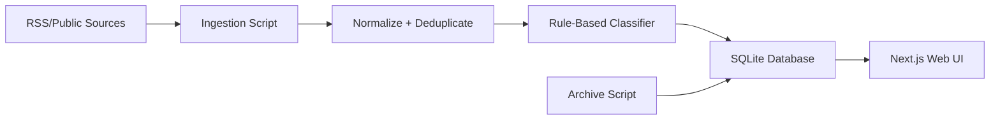

# Architecture

## Summary

Risk Watch uses a local-first architecture: a Next.js web app, a local SQLite database, simple scheduled scripts, and config-driven source/taxonomy files.

## Components

### Web UI

- Built with Next.js.
- Displays feed, archive, source list, category filters, and trend summaries.
- Reads from local data access functions.

### Ingestion

- Pulls RSS/public feeds from `config/sources.json`.
- Normalizes item title, URL, source, dates, and description.
- Deduplicates by canonical URL first, then title/source fallback.

### Classification

- Uses `config/taxonomy.json`.
- Applies keyword and phrase rules.
- Produces labels, confidence, severity, and explanation.

### Storage

SQLite is the preferred MVP store because it is local, free, portable, and simple to back up.

Core tables:

- `sources`
- `articles`
- `article_categories`
- `classification_runs`
- `archive_events`

### Archive

- Default feed window: 7 days.
- Zoom view: 14 days.
- Archive script marks older items as `archived`.
- Archived items stay in the same database for search and trend analysis.

## Future Upgrade Paths

- Postgres if multiple users or hosted deployment becomes necessary.
- SQLite FTS5 for full-text search.
- Local embeddings and FAISS if semantic search becomes valuable.
- Ollama for optional local summarization/classification.
